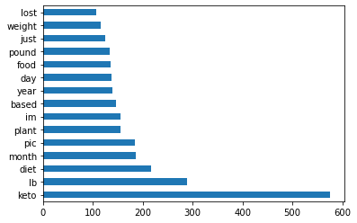
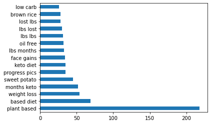
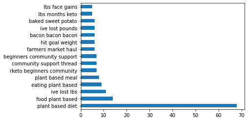

# Reddit Post Analysis

## Problem Statement:
Reddit is a popular social media platform that allows users to make categorial 'subreddits' of common interests.  Users can post questions, comments, updates, links to web pages, and other various information of use to the local subreddit community.  As with other for-profit social media organizations, Reddit sells advertising space to companies as part of their income generation. [link](https://www.redditinc.com/advertising)  One way a company can determine if the Reddit platform is suitable for advertising is to analyze subreddit titles to posts.  This would allow the companies to tailor their advertising to specific sureddits and ensure that they are placing their investment in the correct location.  This project looks at two subreddits: 'keto' and 'PlantBasedDiet' and three extensions within the subreddits: ‘.controversial’, ‘.hot’, and ‘.new’.  The project will also use four different models to determine accuracy, specificity, sensitivity, and precision of predicting subreddits and appropriate advertising space.  Sentiment analysis was also performed to determine if sufficient positive feedback from a subreddit would warrant investing money in advertising.

## Methodology:
The PRAW (Python Reddit API Wrapper) allows access to Reddits API for web scraping.  You can obtain credentials by applying for an app and creating an account.  After the subreddit posts were downloaded, the individual elements were placed in a dictionary, and separated by a column indicating ‘PlantBasedDiet’ (0) or ‘keto’ (1).  The subreddit dataframes were concatenated into one large dataframe with 5653 posts, and after the duplicates were dropped, 5159 posts.  The dataframe was subsequently exported to a .csv file.
To prepare the data for analysis, Natural Language Processing (NLP) was used to strip the titles of all digits and punctuation.  They were then placed in a Lemmatizer [link]( https://stackoverflow.com/questions/47423854/sklearn-adding-lemmatizer-to-countvectorizer), split into training and testing data, and vectorized using CountVectorizer, removing stop words that would have diluted the analysis.  The data was then fit and transformed.
Analysis of word counts, bigrams, and trigrams were performed on the data (as shown).

Four models were used to analyze the titles: Naïve Bayes, Logistic Regression, Random Forest Classifier and Extra Trees Classifer.  Naïve Bayes and Extra Trees Classifier used default parameters.  Logistic Regression utilized a regularization of C =100 or alpha = .01.  Random Forest Classifer was combined with a gridsearch find the optimal parameters of max_depth = None and n_estimators = 200. 

## Results:
 Results of true positive, true negative, false positive, false negative are show in the following table.  
 
|        Model        | TN  | FP  | FN  | TP  |
|:-------------------:|-----|-----|-----|-----|
| Naive Bayes         | 652 | 175 | 117 | 759 |
| Logistic Regression | 632 | 195 | 127 | 749 |
| Random Forest       | 634 | 193 | 124 | 752 |
| Extra Trees         | 643 | 184 | 142 | 734 |

Accuracy, specificity, sensitivity, and precision are shown in the following table.

|         Model         | Accuracy | Specificity | Sensitivity | Precision |
|:---------------------:|----------|-------------|-------------|-----------|
| Naïve   Bayes         |   0.82   |     0.78    |     0.86    |    0.81   |
| Logistic   Regression |   0.81   |     0.76    |     0.85    |    0.79   |
| Random   Forest       |   0.81   |     0.76    |     0.85    |    0.79   |
| Extra   Trees         |   0.81   |     0.77    |     0.83    |    0.79   |

## Conclusions:
As an advertiser for nutritional products it is preferred to have a higher incidence of false negatives that false positives in this instance.  Advertisers would rather advertise plant based products to keto identified users than keto products to plant-based identified users as the plant-based users will not eat meat products.  However, may keto identified users eat much of the plant-based diet in addition to meat.  Therefore, this model is less sensitive to the plant-based identifiers, likely due to the lack of unique words in the titles.  The accuracy of this model is also high and can predict the user based on titles from the posts.

## Further Study:

To further narrow posts of interest to advertisers, sentiment analysis of both title and body of posts in other subreddits for potential buyers of a product.

